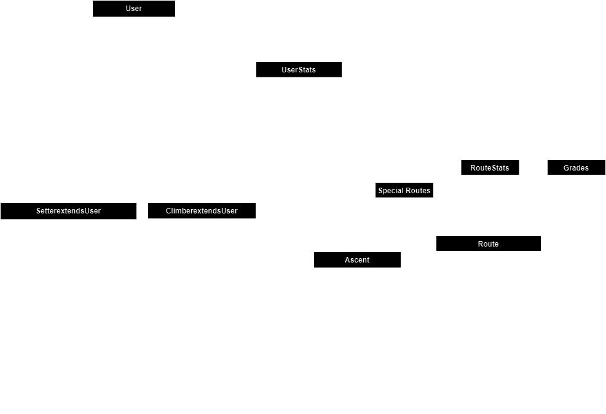

# Implementation

## UML class diagram for the app:
> **_NOTE:_**
> This is a prediction, the names and functions will change along with the progress in the app.

## Brief explanation of the classes

In the **domain package** I have these following classes:
* **[AddImageApp](src/main/java/Bouldering_app/domain/AddImageApp.java)** -> Opens a gui interface to choose from your computer an Image, and we will **make a copy and move it to the images folder**.
* **[Ascent](src/main/java/Bouldering_app/domain/Ascent.java)** -> Contains a Route, datetime when is added and attempts (used further for liveGrade, attempts of a route, user profile stats).
* **[Climber](src/main/java/Bouldering_app/domain/Climber.java)** -> Important user (used in Sign-Up and Log in, creates ascents).
* **[EditImage](src/main/java/Bouldering_app/domain/editImage.java)** -> Opens a gui interface that opens an image specified, and add to it some arrows after a complex algorithms (well talk about it later).
* **[Grade](src/main/java/Bouldering_app/domain/Grade.java)** -> For each route we will have a grade (difficulty), each of them is part of a general grading with colors.
* **[ImageViewer](src/main/java/Bouldering_app/domain/ImageViewer.java)** -> Opens a gui interface that only shows an image specified.
* **[Password_hashing](src/main/java/Bouldering_app/domain/Password_hashing.java)** -> Passwords from sign-up are hashed, and we have a function for authenticate (verify string from log in with the hashed password).
* **[Route](src/main/java/Bouldering_app/domain/Route.java)** -> One of the primarily classes. A bouldering place consists of Routes.
* **[Setter](src/main/java/Bouldering_app/domain/Setter.java)** -> Like an admin for the app, can add routes and archive routes.
* **[User](src/main/java/Bouldering_app/domain/User.java)** -> This is the SuperClass from Route and Setter, it has only the name and password.

In the **services package** I have these following classes:

* **[RouteService](src/main/java/Bouldering_app/services/RouteService.java)** -> This service stores all the routes, so you can add routes, archive, choose a route (terminal view), show image of a route, add an ascent (for a climber)
* **[UserInteractionService](src/main/java/Bouldering_app/services/UserInteractionService.java)** -> An Interface for printing the profile of a user (climber or setter)
* **[UserService](src/main/java/Bouldering_app/services/UserService.java)** -> This service stores all the users, has the Sign-Up and Log In methods + show Ascents

The **[Main](src/main/java/Bouldering_app/Main.java)** class we have an unregistered main page, setter main page and a climber main page. For the current user logged in we use an Int (ID of the user) and we call in the Userservice and RouteService by this id.

## How the important features are made?