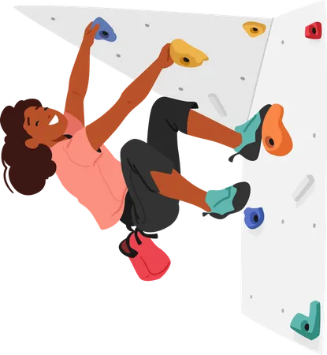
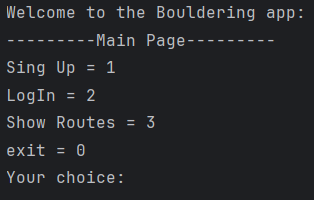
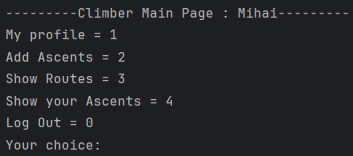

<a name="readme-top"></a>

[![Issues][issues-shield]][issues-url]
![Commits][github-last-commit]
[![MIT License][license-shield]][license-url]
[![LinkedIn][linkedin-shield]][linkedin-url]


<br />
<div align="center">
  <a href="https://github.com/MihaiB-dev/Bouldering_app">
    
  </a>

<h3 align="center">Bouldering app project in Java</h3>

  <p align="center">
    A way for climbers to track what routes they have done in the past and for setters to publish their routes.
    <br />
    <a href="https://github.com/MihaiB-dev/Bouldering_app/blob/main/Implementation.md"><strong>Explore the docs »</strong></a>
    <br />
    <br />
    <!-- <a href="">View Demo</a> -->
    ·
    <a href="https://github.com/MihaiB-dev/Bouldering_app/issues/new?labels=bug&template=bug-report--.md">Report Bug</a>
    ·
    <a href="https://github.com/othneildrew/Best-README-Template/issues/new?labels=enhancement&template=feature-request--.md">Request Feature</a>
  </p>
</div>

<details>
  <summary>Table of Contents</summary>
  <ol>
    <li>
      <a href="#about-the-project">How bouldering works</a>
      <ul>
        <li><a href="#tech-details">Usage</a></li>
        <li><a href="#built-with">Built With</a></li>
      </ul>
    </li>
    <li>
      <a href="#getting-started">Getting Started</a>
      <ul>
        <li><a href="#prerequisites">Prerequisites</a></li>
        <li><a href="#installation">Installation</a></li>
      </ul>
    </li>
    <li><a href="#usage">Usage</a></li>
    <li><a href="#roadmap">Roadmap</a></li>
    <li><a href="#license">License</a></li>
    <li><a href="#contact">Contact</a></li>
  </ol>
</details>

## About the Project

### How bouldering works?
Bouldering is a style of climbing done close to the ground without the use of ropes and harnesses, and with crash matting for protection. 
On a single wall there are routes with a variety of difficulties from which you can choose from. For this app we will use **Font-Scale (French)** and **colours**. 

We will have these specified **grades**: 
* <span style="color:#C6FC79">(green zone beginners)</span>> 4, 5, 5+
* <span style="color:#FFE540">(yellow zone intermediate)</span> 6a, 6a+, 6b, 6b+, 6c, 6c+, 7a
* <span style="color:#FF7844">(red zone Advanced)</span> 7a+, 7b, 7b+, 7c
* <span style="color:#CE45FF">(purple zone Pro)</span> 7c+, 8a, 8a+, 8b
* <span style="color:#FFFCF8">(Whitezone Elite)</span> 8b+, 9a, 8c+ 

<p align="right">(<a href="#readme-top">back to top</a>)</p>

### What is my contribution to this community?

There are some features that I want to implement during this project:
1. A **secure way to sign-up and log-in** on the platform
2. A way for setters to **add a route image** into the database
3. **Specify on the image** what is the route itself (click on a volume and create a pointer to that volume)
4. A feature for climbers to **add their Ascents** to their profile
5. A **custom profile with stats** that are dynamically changing after each ascent. (Like in GTA 5)
6. A feature for setters to **add the routes in the archives** (for future use)
7. Setters can **grade their routes that gradually changes** due to average grade ascents of climbers that complete the route.
8. A **main page** with all routes that are active on the walls.
9. A visualization for Climbers to see their **Ascents sorted by difficulty**
10. **Most popular routes** currently on the walls.

<p align="right">(<a href="#readme-top">back to top</a>)</p>

### Tech details
For more information about what contains each class and about how the functions work, please refer to the [Documentation](Implementation.md)

### Built With
* [![Static Badge][Java]][Java-url]
* [![Static Badge][OpenCV]][OpenCV-url]
* [![[Static Badge]][pbkdf2]][pbkdf2-url]


## Getting Started

For this app we will need to install OpenCV, and clone the project

### Prerequisites
1. Follow this tutorial to [Install OpenCV](https://opencv.org/get-started/)

### Installation
1. Clone the repo
```sh
   git clone https://github.com/MihaiB-dev/Bouldering_app
   ```
2. If you are using Intellij, you can watch with [tutorial](https://opencv.org/get-started/)

## Usage
Firstly, run the Main.java.
There are 3 pages : unregistered Page, setters main page and climbers main page.
Unregistered page, first that you will see:



Setter main page:


Climber main page:



<p align="right">(<a href="#readme-top">back to top</a>)</p>

## Roadmap
- [x] Create an authentication process for users
- [x] Create a method to add routes as image, and edit on image (computer vision)
- [x] Create the user profile (printing)
- [x] Add ascents as climbers (auto functions : update user stats, auto increment route attempts with attempts from the usera ascent, update average grade from the user, update the liveGrade of the route by getting the average of all users that added this route to their ascents)
- [x] Archive routes as setters
- [ ] Connect to a database all the data stored
- [ ] Add exceptions (catch errors that may be)
- [ ] Create a log for setters with routes that should be replaced soon
- [ ] Log for setters when a new route is added

See the [open issues](https://github.com/MihaiB-dev/Bouldering_app/issues) for a full list of proposed features (and known issues).
## License
Distributed under the MIT License. See `LICENSE.txt` for more information.

<p align="right">(<a href="#readme-top">back to top</a>)</p>


## Contact

Bivol Mihai - mihaibivol.dev@gmail.com

Project Link: [https://github.com/MihaiB-dev/Bouldering_app](https://github.com/MihaiB-dev/Bouldering_app)

<p align="right">(<a href="#readme-top">back to top</a>)</p>


<!-- Markdown links and images-->
[issues-shield]: https://img.shields.io/github/issues/MihaiB-dev/Bouldering_app?style=for-the-badge
[issues-url]: https://github.com/MihaiB-dev/Bouldering_app/issues
[license-shield]: https://img.shields.io/github/license/othneildrew/Best-README-Template.svg?style=for-the-badge
[license-url]: https://github.com/MihaiB-dev/Bouldering_app/blob/main/LICENSE
[linkedin-shield]: https://img.shields.io/badge/-LinkedIn-black.svg?style=for-the-badge&logo=linkedin&colorB=555
[linkedin-url]: https://www.linkedin.com/in/mihai-bivol/
[github-last-commit]: https://img.shields.io/github/commit-activity/m/MihaiB-dev/Bouldering_app/main?style=for-the-badge
[pbkdf2]: https://img.shields.io/badge/-ceva?style=for-the-badge&label=pbkdf2%20encryption&color=d27af0

[pbkdf2-url]: https://cryptobook.nakov.com/mac-and-key-derivation/pbkdf2
[Java]: https://img.shields.io/badge/-ceva?style=for-the-badge&logo=java&label=Java&color=%23ffb84d
[Java-url]: https://www.java.com/en/
[OpenCV]: https://img.shields.io/badge/-ceva?style=for-the-badge&logo=OpenCV&label=OpenCV&color=%2359cbff
[OpenCV-url]: https://opencv.org/