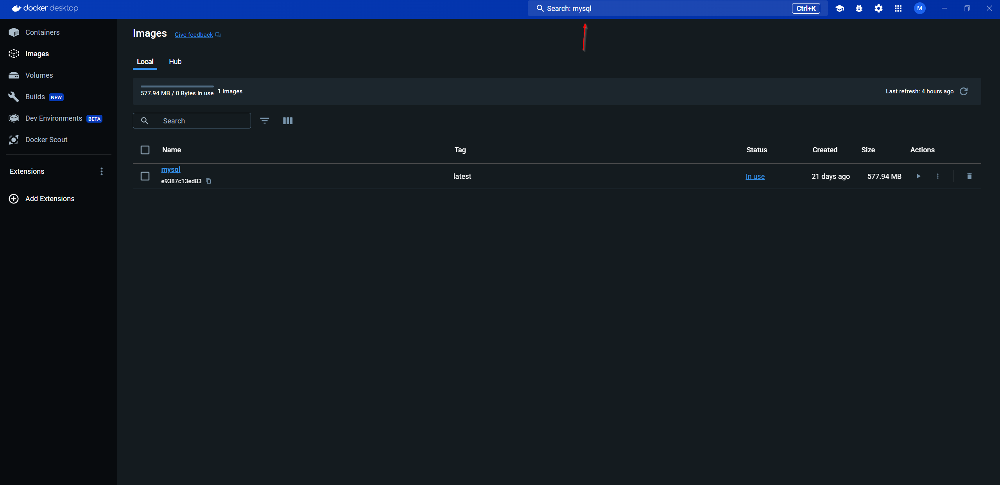
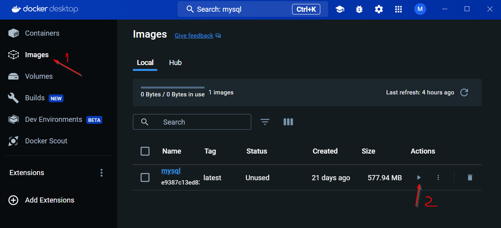
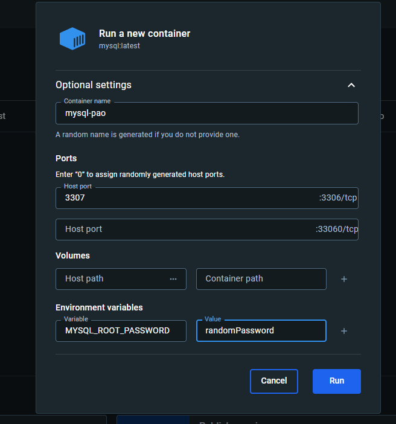
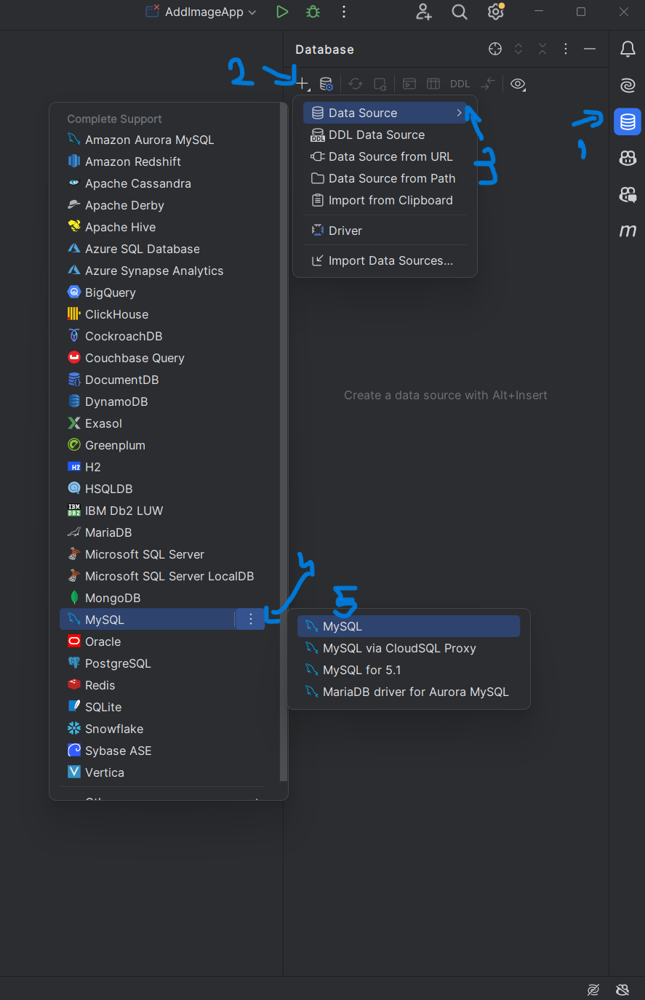
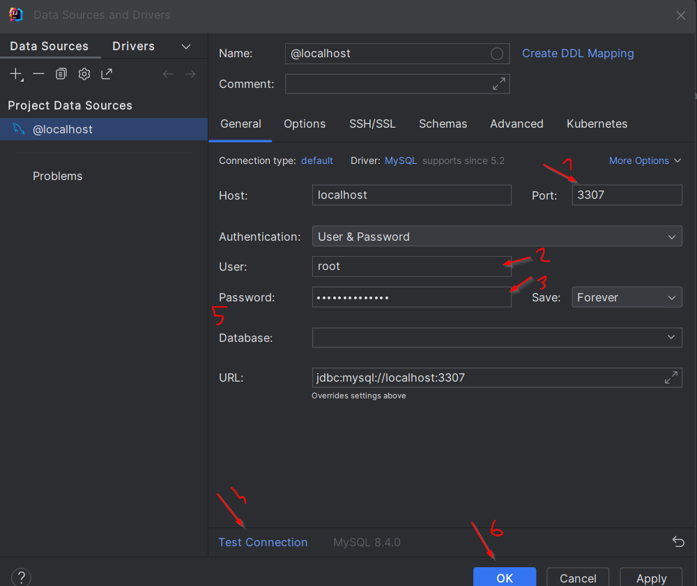

## How to connect the database with the project in intellij

### Step 1 - Install Docker Desktop

URL : https://www.docker.com/products/docker-desktop/

### Step 2 - Search mysql and click on mysql



### Step 3 - Make sure to have the tag : latest and click Run
Now in the background it will install an image with mysql.
Also, you can look at [mysql docs](https://hub.docker.com/_/mysql?uuid=BF7E2721-8342-4AA3-8D94-7C0612672201) while is downloading.

### Step 4 - Create a mysql container
On the left side you have a nivagation bar (Containers, Images, Volumes, etc.)


**Click** on Images -> **Click** on the run button on the right side of mysql line.



**Open** Optional settings:   
Example:



**Click** Run

### Step 5 - Go to intellij and create the conection

This is an image from the right side of intellij


Write root for username, port 3307, password, test connectivity , rewrite password and click **ok**


### Step 6 - create the database
After pressing ok, a new tab will appear with the name console. 
In it type 
```mysql
create database yourdatabasename;
```
If you close it by mistake, you can reopen it by **right click** on the right side to localhost -> new -> Query Console


